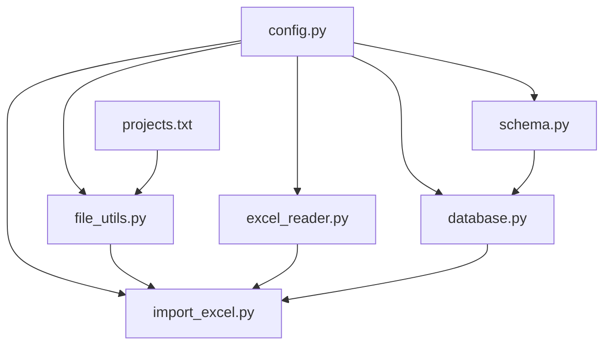
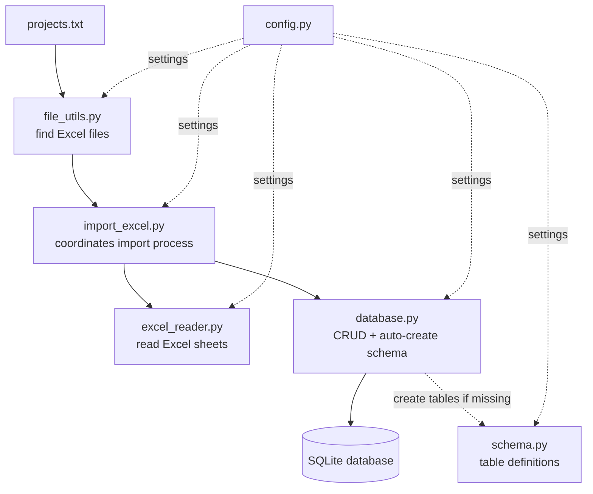

# README

## Project description

This project imports data from Excel files into a SQLite database.
The goal is to collect contract information (budget, basic details, working hours) in one place for further analysis (e.g., Power BI).

---

## Data flow (overview)

| Step | Module          | Action                                                   |
| ---- | --------------- | -------------------------------------------------------- |
| 1    | projects.txt    | Contains list of contract IDs (e.g., `1_2025`)           |
| 2    | file_utils.py   | Finds Excel files and matches them to contracts          |
| 3    | excel_reader.py | Reads data from Excel sheets (budget, basic info, hours) |
| 4    | schema.py       | Defines database schema (table structure)                |
| 5    | database.py     | Handles DB operations (CRUD + auto-create schema)        |
| 6    | import_excel.py | Main script – coordinates import process                 |

---

## Dependency graph (imports)

This diagram shows which modules **import or depend on** which.



---

## Data flow (how data moves)

This diagram shows how data flows from Excel files into the database.



---

## File reference

| File            | Purpose                                                         |
| --------------- | --------------------------------------------------------------- |
| config.py       | Central settings (paths, table names, column mapping)           |
| projects.txt    | List of contract IDs to process (one per line)                  |
| file_utils.py   | Finds Excel files and maps them to contracts                    |
| excel_reader.py | Reads Excel sheets → returns DataFrames (budget, basic, hours)  |
| schema.py       | Defines the SQLite schema (table structures only)               |
| database.py     | Database operations (insert, delete, check, auto-create schema) |
| import_excel.py | Main script – coordinates import process                        |

---

## Running the project

1. **Start fresh (optional)**

   - If you want a clean DB, simply delete the file in `DB/table_project.db`.
   - On the next run, tables will be created automatically.

2. **Add contract numbers**

   - Add entries like `1_2025`, `2_2025` to `projects.txt` (one per line).
   - Place matching Excel files in `workbooks/` (e.g., `./workbooks/1_2025.xlsx`).

3. **Import data**

   ```bash
   python import_excel.py
   ```

You should see a summary with how many contracts were processed and database statistics.

---

## Important Details

- Column names and sheet ranges are controlled in `config.py`.
- Tables are created automatically on first run.
- The script safely re-imports a contract by deleting old rows for that `contract_id` and inserting the latest data.
- Expected Excel sheets:

  - **Project Costs**
  - **start**
  - **Hourly and Rate Report**

---

## TODO / Future Improvements

- **Better error messages**: Show which Excel sheet/cell caused errors
- **Input validation**: Check if Excel files have required sheets before processing
- **Summary report**: Generate simple text report after import
- **GUI interface**: Simple desktop app instead of command line
- **Data backup**: Manual backup command before major imports
